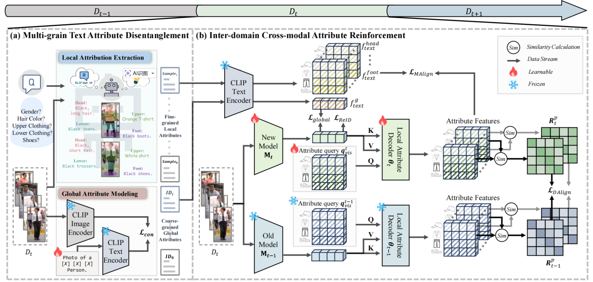
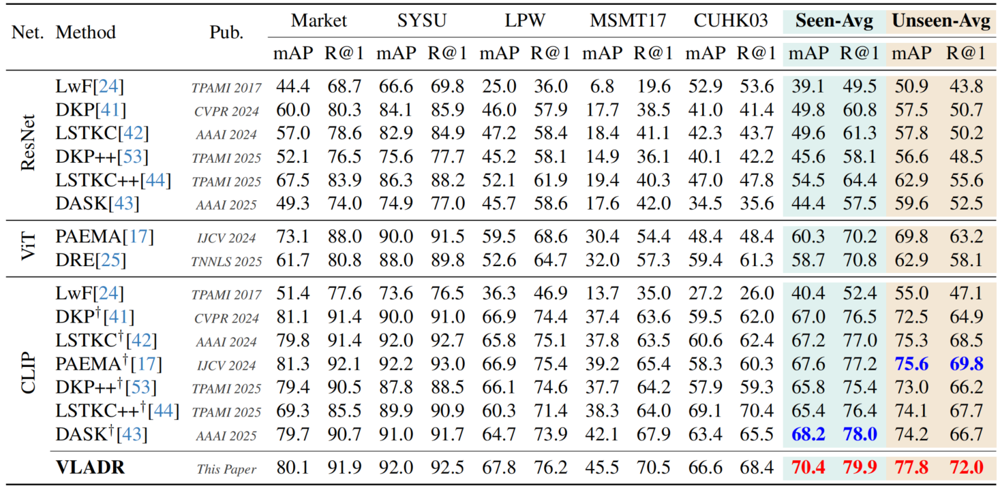

# [CVPR2026] Vision-Language Attribute Disentanglement and Reinforcement<br>for Lifelong Person Re-Identification
<div align="center">

<!-- <h1>Vision-Language Attribute Disentanglement and Reinforcement<br>for Lifelong Person Re-Identification</h1> -->

<p>
  <a href="https://cvpr.thecvf.com/Conferences/2026"></a>
  <a href='https://arxiv.org/pdf/2603.19678'></a>
  
</p>

<p>
  <strong>Kunlun Xu</strong><sup>1</sup>&emsp;
  <strong>Haotong Cheng</strong><sup>1</sup>&emsp;
  <strong>Jiangmeng Li</strong><sup>2</sup>&emsp;
  <strong>Xu Zou</strong><sup>3</sup>&emsp;
  <strong>Jiahuan Zhou</strong><sup>1*</sup>
</p>

<p>
  <sup>1</sup>Wangxuan Institute of Computer Technology, Peking University &nbsp;|&nbsp;
  <sup>2</sup>University of Chinese Academy of Sciences &nbsp;|&nbsp;
  <sup>3</sup>School of Artificial Intelligence and Automation, Huazhong University of Science and Technology
</p>

</div>

---

> **Official repository** for *Vision-Language Attribute Disentanglement and Reinforcement for Lifelong Person Re-Identification* (CVPR 2026).

## Overview

VLADR tackles **Lifelong Person Re-Identification** using vision-language alignment. The pipeline consists of two stages:

- **Stage 1 — Multi-grain Text Attribute Disentanglement (MTAD):** Extracts multi-grain attributes via local attribute extraction and global attribute modeling.
- **Stage 2 — Inter-domain Cross-modal Attribute Reinforcement (ICAR):** Loads Stage 1 prompt checkpoints and leverages pre-extracted text descriptions to fine-tune the image encoder.



## Installation

After project VLADR have been downloaded to home, then run:

```shell
conda create -n VLADR python=3.9
conda activate VLADR
pip install torch==2.5.1 torchvision==0.20.1 torchaudio==2.5.1 --index-url https://download.pytorch.org/whl/cu124
pip install -r requirements.txt
python setup.py develop
```
> After setup, activate the environment normally in future sessions with `conda activate VLADR`.

## Prepare Datasets

Download the following person re-identification datasets and place them under a root directory (e.g., `PRID/`):

| Dataset | Link |
|---------|------|
| Market-1501 | [Google Drive](https://drive.google.com/file/d/0B8-rUzbwVRk0c054eEozWG9COHM/view) |
| MSMT17 | [pkuvmc.com](http://www.pkuvmc.com/dataset.html) |
| CUHK03 | [GitHub](https://github.com/zhunzhong07/person-re-ranking/tree/master/evaluation/data/CUHK03) |
| SenseReID | [Google Drive](https://drive.google.com/file/d/0B56OfSrVI8hubVJLTzkwV2VaOWM/view) |
| Others | [Torchreid Docs](https://kaiyangzhou.github.io/deep-person-reid/datasets.html) / [light-reid](https://github.com/wangguanan/light-reid) |

The expected directory structure:

```
PRID
├── CUHK01/
├── CUHK02/
├── CUHK03/
├── CUHK-SYSU/
├── DukeMTMC-reID/
├── grid/
├── i-LIDS_Pedestrain/
├── MSMT17_V2/
├── Market-1501/
├── prid2011/
├── SenseReID/
└── viper/
```

## Quick Start


### Training

**Stage 1 — Multi-grain Text Attribute Disentanglement (MTAD)**

```shell
bash train1.sh
```

> Attributes have been pre-extracted and stored in `./_BLIP_TEXT_DESC` and `_STAGE1_PROMPTS_WEIGHT`. You can directly proceed to Stage 2 simply by using the aforementioned resources.

**Stage 2 — Inter-domain Cross-modal Attribute Reinforcement (ICAR)**

```shell
bash train2.sh
```


### Evaluation

Pre-trained models are provided for quick evaluation:

```shell
bash test.sh
```
## Results

Results obtained with **two NVIDIA RTX 4090 GPUs**:



## Citation

If you find this work useful for your research, please consider citing:

```bibtex
@inproceedings{xu2026vladr,
  title={Vision-Language Attribute Disentanglement and Reinforcement for Lifelong Person Re-Identification},
  author={Xu, Kunlun and Cheng, Haotong and Li, Jiangmeng and Zou, Xu and Zhou, Jiahuan},
  booktitle={Proceedings of the IEEE/CVF Conference on Computer Vision and Pattern Recognition},
  year={2026}
}
```

### We have conducted a series of research in Lifelong Person Re-Identification as follows.

#### Semi-Supervised Lifelong Learning
```shell
@inproceedings{xu2025self,
  title={Self-reinforcing prototype evolution with dual-knowledge cooperation for semi-supervised lifelong person re-identification},
  author={Xu, Kunlun and Zhuo, Fan and Li, Jiangmeng and Zou, Xu and Zhou, Jiahuan},
  booktitle={Proceedings of the IEEE/CVF International Conference on Computer Vision},
  pages={3564--3574},
  year={2025}
}
```

#### Image-level Distribution Modeling and Transfer:
```shell
@inproceedings{xu2025dask,
  title={Dask: Distribution rehearsing via adaptive style kernel learning for exemplar-free lifelong person re-identification},
  author={Xu, Kunlun and Jiang, Chenghao and Xiong, Peixi and Peng, Yuxin and Zhou, Jiahuan},
  booktitle={Proceedings of the AAAI Conference on Artificial Intelligence},
  volume={39},
  number={9},
  pages={8915--8923},
  year={2025}
}
```
#### Feature-level Distribution Modeling and Prototyping:
```shell
@article{zhou2025distribution,
  title={Distribution-Aware Knowledge Aligning and Prototyping for Non-Exemplar Lifelong Person Re-Identification},
  author={Zhou, Jiahuan and Xu, Kunlun and Zhuo, Fan and Zou, Xu and Peng, Yuxin},
  journal={IEEE Transactions on Pattern Analysis and Machine Intelligence},
  year={2025},
  publisher={IEEE}
}

@inproceedings{xu2024distribution,
  title={Distribution-aware Knowledge Prototyping for Non-exemplar Lifelong Person Re-identification},
  author={Xu, Kunlun and Zou, Xu and Peng, Yuxin and Zhou, Jiahuan},
  booktitle={Proceedings of the IEEE/CVF Conference on Computer Vision and Pattern Recognition},
  pages={16604--16613},
  year={2024}
}
```
#### Long Short-Term Knowledge Rectification and Consolidation:
```shell
@article{xu2025long,
  title={Long Short-Term Knowledge Decomposition and Consolidation for Lifelong Person Re-Identification},
  author={Xu, Kunlun and Liu, Zichen and Zou, Xu and Peng, Yuxin and Zhou, Jiahuan},
  journal={IEEE Transactions on Pattern Analysis and Machine Intelligence},
  year={2025},
  publisher={IEEE}
}


@inproceedings{xu2024lstkc,
  title={Lstkc: Long short-term knowledge consolidation for lifelong person re-identification},
  author={Xu, Kunlun and Zou, Xu and Zhou, Jiahuan},
  booktitle={Proceedings of the AAAI Conference on Artificial Intelligence},
  volume={38},
  number={14},
  pages={16202--16210},
  year={2024}
}
```
#### Lifelong Learning with Label Noise:
```shell 
@inproceedings{xu2024mitigate,
  title={Mitigate Catastrophic Remembering via Continual Knowledge Purification for Noisy Lifelong Person Re-Identification},
  author={Xu, Kunlun and Zhang, Haozhuo and Li, Yu and Peng, Yuxin and Zhou, Jiahuan},
  booktitle={Proceedings of the 32nd ACM International Conference on Multimedia},
  pages={5790--5799},
  year={2024}
}
```

#### Prompt-guided Adaptive Knowledge Consolidation:
```shell
@article{li2024exemplar,
  title={Exemplar-Free Lifelong Person Re-identification via Prompt-Guided Adaptive Knowledge Consolidation},
  author={Li, Qiwei and Xu, Kunlun and Peng, Yuxin and Zhou, Jiahuan},
  journal={International Journal of Computer Vision},
  pages={1--16},
  year={2024},
  publisher={Springer}
}
```

#### Compatible Lifelong Learning:
```shell
@inproceedings{cui2024learning,
  title={Learning Continual Compatible Representation for Re-indexing Free Lifelong Person Re-identification},
  author={Cui, Zhenyu and Zhou, Jiahuan and Wang, Xun and Zhu, Manyu and Peng, Yuxin},
  booktitle={Proceedings of the IEEE/CVF Conference on Computer Vision and Pattern Recognition},
  pages={16614--16623},
  year={2024}
}
```

## Acknowledgement

Our code is built upon [DASK](https://github.com/zhoujiahuan1991/AAAI2025-LReID-DASK) and [CLIP-ReID](https://github.com/Syliz517/CLIP-ReID). We sincerely thank the authors for their excellent work.

## Contact

For questions, feel free to reach out at **xkl@stu.pku.edu.cn**.

Visit our lab homepage [**OV³ Lab**](https://zhoujiahuan1991.github.io/) for more papers, code, and datasets.

